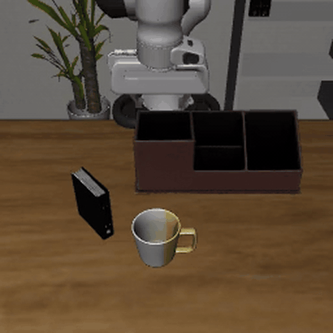
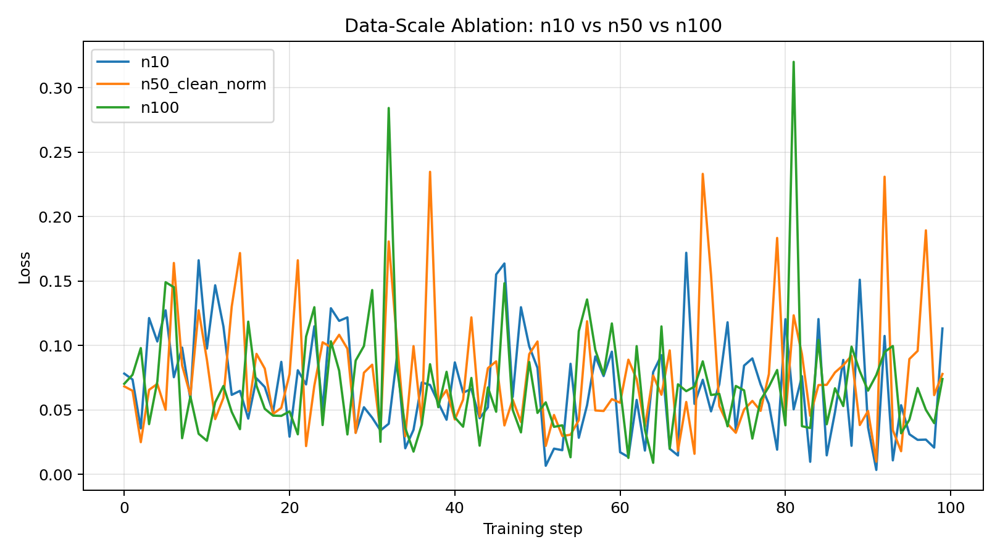
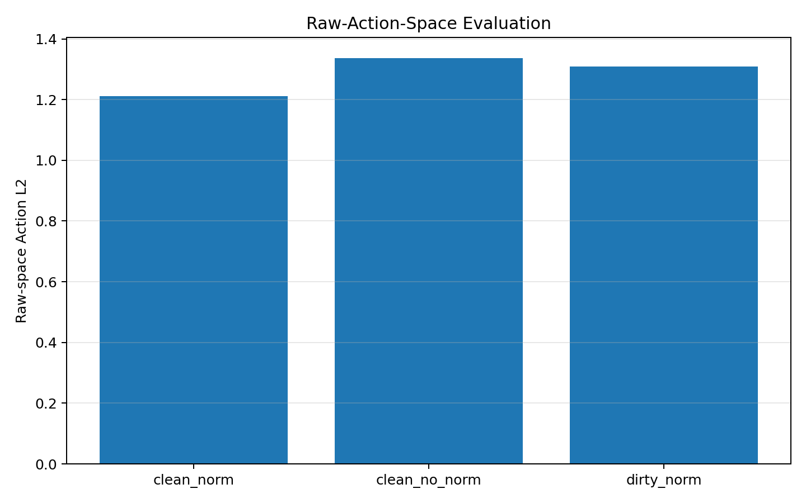
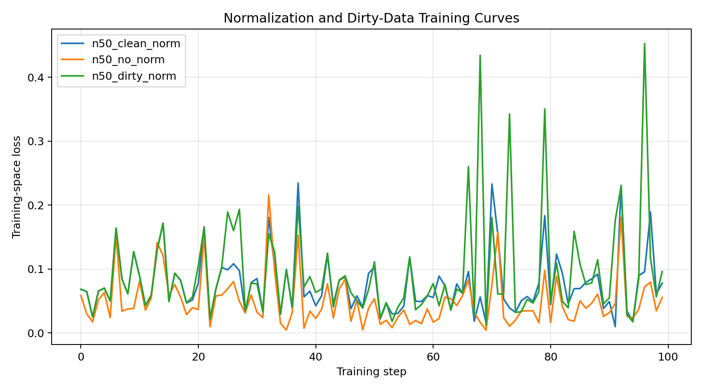

# pi05-libero-finetune

基于 **openpi / π0.5** 的 LIBERO 数据理解、LeRobot 数据验证、LoRA / SFT 微调、离线动作评测、闭环 rollout、失败分析与部署测试项目。

本项目不重新设计 VLA 架构，而是完成一条清晰、可复查的工程闭环：

```text
LIBERO 数据理解
→ LeRobot 数据格式分析
→ 数据检查与可视化
→ Quantile Normalization
→ π0.5 LoRA / SFT
→ 固定离线动作评测
→ LIBERO 闭环 Rollout
→ 正式策略对照
→ 失败分布与受控鲁棒性
→ bf16 部署指标
```

## Rollout Demos

### Successful Rollouts

#### Task 1 — Two-object sequential manipulation


#### Task 4 — Object-target association


#### Task 5 — Book placement in the caddy



### Representative Failures

#### Task 5 — Placement outside target


#### Task 8 — Second-object grasp failure


#### Task 9 — Premature microwave placement


> The GIFs are compressed previews. Full-resolution MP4 files are available in [`docs/media/day24/`](docs/media/day24/README.md).

## Key Results

- **数据与验证**：完成 LIBERO / LeRobot 图像、state、action、task、episode 与 metadata 全链路检查；深度检查 100 个 episode，`flagged_episodes = 0`。
- **Normalization 消融**：统一反归一化到原始动作空间后，Clean + Norm 优于 Clean + No-Norm，Action L2 为 `1.212 vs 1.337`；小尺度动作维度误差降低约 2–6 倍。
- **Synthetic Dirty-Data 消融**：向部分动作帧注入有限离群值后，训练 loss 波动增加 `68.4%`，未见 episode 上 Action L2 上升约 `8.0%`。
- **第二轮 SFT**：将 batch size 从 1 调整为 4，使用 500-step warmup 与 cosine decay，训练约 2.02 epoch；固定离线验证集上 Action L2 从旧 5k 的 `1.4378` 降至 `0.4371`，gripper sign accuracy 从 `48%` 提升至 `89%`。
- **Task 5 正式对照**：相同 states 0–9 下，官方 π0.5 为 `10/10`，旧 5k 为 `0/10`，第二轮 step 13,999 为 `9/10`。
- **跨任务能力**：Task 1 在 states 0–9 上达到 `10/10`；LIBERO-10 每任务三个初始状态的覆盖筛查达到 `25/30`。
- **失败诊断**：五条筛查失败主要表现为末端放置越界、接触后未成功抓起，以及第二物体阶段的反复重抓；Task 8 是当前最明显的长时序多物体弱点。
- **受控鲁棒性**：Task 5 state 0 与 state 2 分别为 `9/10` 和 `7/10`；四条失败全部出现 x 轴 containment miss，但当前样本量不足以声称统计显著差异。
- **bf16 部署**：RTX 5090、batch size 1 下，预热后平均 policy-query latency 为 `83.246 ms`，P95 为 `99.901 ms`；模型驻留显存约 `24.040 GiB`，观测峰值约 `24.114 GiB`。

> `25/30` 是每任务三个初始状态的覆盖筛查结果，不是官方 LIBERO-10 benchmark 成功率。

## Documentation

- [Evaluation Protocol](docs/eval_protocol.md)
- [Failure Distribution](docs/failure_distribution.md)
- [Deployment Note](docs/deployment_note.md)
- [Representative Rollout Videos](docs/media/day24/README.md)

---


## 1. Project Goal

本项目用于复现和理解 π0.5 在 LIBERO 数据上的完整工程流程，重点包括：

1. 理解 LIBERO 数据来源与 LeRobot 存储格式
2. 分析 openpi 中 `pi05_libero` 配置与数据字段的对应关系
3. 搭建图像、state、action、task 和 episode 完整性检查流程
4. 运行 π0.5 LoRA 小规模训练并记录 checkpoint 与 loss
5. 完成数据规模、Normalization 和 Synthetic Dirty-Data 消融
6. 在统一原始动作空间中完成公平离线评测
7. 完成 LIBERO 闭环 rollout、正式策略对照、失败分布、受控鲁棒性和部署测试

项目对标 VLA / 具身智能实习岗位中的以下能力：

- VLA 模型复现与 LoRA 微调
- 多模态机器人数据处理
- LeRobot / LIBERO 数据格式理解
- openpi / π0.5 训练配置与数据管线分析
- 数据验证、异常构造与消融实验设计
- checkpoint 推理、原始动作空间评测与闭环 rollout
- 失败分布、受控鲁棒性和 success predicate 分析
- bf16 推理延迟、显存测量与部署记录
- 实验日志、图表和技术结论整理

## 2. Data Pipeline

LIBERO 数据进入 π0.5 训练流程的核心链路为：

```text
openvla/modified_libero_rlds
→ examples/libero/convert_libero_data_to_lerobot.py
→ physical-intelligence/libero
→ pi05_libero
→ scripts/train.py
```

| Component | Meaning |
|---|---|
| `openvla/modified_libero_rlds` | 原始 LIBERO / RLDS 数据 |
| `convert_libero_data_to_lerobot.py` | LIBERO 到 LeRobot 格式的转换脚本 |
| `physical-intelligence/libero` | 已转换好的 LeRobot 格式 LIBERO 数据集 |
| `pi05_libero` | openpi 中 π0.5 + LIBERO 的训练配置 |
| `scripts/train.py` | openpi 训练入口 |

当前项目没有重新生成新的 `converted_dataset/`，而是复用已有的本地 LeRobot 缓存：

```text
${LEROBOT_HOME}/physical-intelligence/libero
```

其中 `LEROBOT_HOME` 指向本机 LeRobot 缓存目录，其他机器需要根据实际目录设置。

---

## 3. Dataset Source

当前使用的数据集 `repo_id`：

```text
physical-intelligence/libero
```

本地缓存路径：

```text
${LEROBOT_HOME}/physical-intelligence/libero
```

当前检查结果：

```text
num_episode_files = 1693
num_tasks_loaded  = 40
```

Metadata 文件包括：

```text
meta/tasks.jsonl
meta/episodes.jsonl
meta/info.json
meta/stats.json
```

---

## 4. Episode Parquet Format

每个 episode parquet 中包含：

```text
image
wrist_image
state
actions
timestamp
frame_index
episode_index
index
task_index
```

核心训练字段：

| Field | Meaning |
|---|---|
| `image` | 主视角 RGB 图像 |
| `wrist_image` | 手腕相机 RGB 图像 |
| `state` | 机器人状态，8 维 |
| `actions` | 机器人动作标签，7 维 |
| `task_index` | 语言任务编号 |
| `timestamp` | 时间戳 |
| `frame_index` | 当前 episode 内的帧编号 |
| `episode_index` | 当前轨迹编号 |
| `index` | 全局样本编号 |

注意：

```text
实际状态字段名：state
实际动作字段名：actions
```

---

## 5. Image / State / Action Format

图像字段：

```text
image       = 256 × 256 RGB
wrist_image = 256 × 256 RGB
```

状态与动作：

```text
state   = 8 dimensions
actions = 7 dimensions
```

Day10 抽查 6 个 episode，共 1908 帧：

```text
state shape   = [1908, 8]
actions shape = [1908, 7]
```

动作范围：

```text
actions global_min = -1.0
actions global_max = 1.0
```

抽样数据中未发现空动作、全零动作或明显异常极值。

---

## 6. Language Task / Prompt Mapping

episode parquet 中直接保存 `task_index`，语言任务文本保存在：

```text
meta/tasks.jsonl
```

映射关系：

```text
task_index
→ meta/tasks.jsonl
→ task_text
```

在 openpi / π0.5 中：

```text
task_text ≈ prompt
```

`pi05_libero` 使用：

```python
prompt_from_task=True
```

表示训练时语言 prompt 会根据 LIBERO task 信息自动构造。

---

## 7. Current Training Format

当前 VLA 训练输入输出：

```text
image + wrist_image + state + task_text
→ future actions [10, 7]
```

其中：

```text
image       = 主视角图像
wrist_image = 手腕相机图像
state       = 8 维机器人状态
task_text   = 由 task_index 映射得到的语言任务指令
actions     = 未来长度为 10 的动作序列，每步 7 维
```

模型学习的是：

> 在当前视觉、机器人状态和语言任务条件下，预测未来长度为 10 的 action chunk。

---

## 8. pi05_libero Config

| Config Item | Value |
|---|---|
| config name | `pi05_libero` |
| model | `pi0.Pi0Config(pi05=True)` |
| data config | `LeRobotLiberoDataConfig` |
| repo_id | `physical-intelligence/libero` |
| prompt_from_task | `True` |
| action_horizon | `10` |
| batch_size | `256` |
| num_train_steps | `30000` |

这说明 openpi 中的 `pi05_libero` 与当前本地 LIBERO / LeRobot 数据缓存是对齐的。

---

## 9. Data Check Progress

> Day 编号沿用原 28 天计划（整合计划 Day N ≈ 原计划 Day N+14，例如消融实验为整合计划 Day 4 = 原计划 Day 18）。

已完成：

```text
Day8   Dataset parser
Day9   Image / wrist image check
Day10  Action / state statistics
Day11  Clean check
Day12  Data format alignment
Day13  Dataset visualization
Day14  Dataset / model survey
Day17  Norm stats validation
Day18  Data validation and ablation experiments
```

### Day8: Dataset Parser

已确认：

1. 本地 LIBERO cache 可以读取
2. episode parquet 文件存在
3. `task_index` 可映射到 `task_text`
4. `sample_index / frame_index / episode_index / task_index` 含义已区分

### Day9: Image Check

已确认：

1. `image` 可以正常读取
2. `wrist_image` 可以正常读取
3. 图像格式为 256×256 RGB
4. 图像不是空图、黑图或乱码图

### Day10: Action / State Statistics

已确认：

```text
state   = 8 维
actions = 7 维
actions range ≈ [-1, 1]
```

### Day11 / Day18: Data Validation

早期抽查 6 个 episode、1908 帧，未发现图像缺失、NaN、Inf、空动作或明显离群值。

Day18 进一步检查前 100 个 episode：

```text
checked_episodes = 100
flagged_episodes = 0
```

检查内容覆盖：

- NaN / Inf
- 空轨迹和过短轨迹
- state / actions 字段缺失
- image / wrist_image 缺失
- task 映射失败
- action / state 异常值
- episode metadata 与 parquet 文件一致性

LIBERO 作为学术基准数据集本身质量较高，因此没有强行进行两组完全相同的 raw-vs-cleaned 训练，而是将主消融调整为数据规模、Normalization 和 Synthetic Dirty-Data 三类实验。

### Day12: Data Format Alignment

已确认：

1. `repo_id = physical-intelligence/libero`
2. 本地路径与缓存一致
3. episode parquet 字段与训练输入对齐
4. `pi05_libero` 使用 `LeRobotLiberoDataConfig`
5. `prompt_from_task=True`
6. 当前训练格式为 `image + wrist_image + state + task_text → future actions`

### Day13: Dataset Visualization

抽查 6 个 episode，每个生成：

```text
main image grid
wrist image grid
action curve
state curve
```

共生成 18 张 PNG 和 1 个 `visualize_summary.json`。

已确认：

1. main / wrist 图像可正常展示
2. action 7 维曲线正常
3. 第 7 维在 -1 / 1 间切换，对应 gripper 开合
4. state 8 维曲线连续
5. episode 能正确对齐 `task_index` 与 `task_text`

### Day14: VLA Dataset / Model Survey

完成：

- 4 个数据集：LIBERO / OXE / DROID / AgiBot World
- 8 个模型：RT-1 / RT-2 / OpenVLA / π0 / π0.5 / RDT-1B / GR00T N1 / π0.6

梳理主线：

```text
离散 token
→ VLM 迁移
→ 连续动作生成
→ 开放世界泛化
→ 真机 RL
```

详细文档：

```text
docs/vla_dataset_survey.md
docs/vla_model_survey_update.md
```

---

## 10. Training Debug Pipeline

已完成 `pi05_libero_debug_lora` 的 100-step debug training。

当前可行配置：

```text
config = pi05_libero_debug_lora
batch_size = 1
max_token_len = 64
num_train_steps = 100
```

24 GB 显存下可行方案：

```text
LoRA + batch_size=1 + max_token_len=64
```

该阶段主要确认：

1. 训练入口可以启动
2. `pi05_libero` 配置可以读取
3. 数据字段可以正常进入训练
4. loss 可以正常记录
5. checkpoint 可以保存
6. 显存占用可控

---

## 11. Norm Stats

Normalization statistics pipeline 已在 LIBERO 数据集上完成验证。

命令：

```bash
uv run python scripts/compute_norm_stats.py \
  --config-name pi05_libero_debug_lora \
  --max-frames 100
```

结果：

```text
Train examples: 273465
Frames used: 100
State dimension: 8
Action dimension: 7
```

相关产物：

```text
docs/norm_stats_note.md
logs/day17_norm_stats/run_summary.txt
results/norm_stats/norm_stats_debug_100.json
```

需要注意：

> 当前 π0.5 配置使用 quantile normalization，而不是只依赖简单的 mean/std 标准化。统计文件同时参与训练输入变换和推理输出反变换。

---

## 12. Ablation Experiments

所有实验均基于 π0.5 LoRA，batch size 为 1，训练 100 step。除被研究变量外，其余模型、初始 checkpoint、优化器和训练配置保持一致。

### 12.1 Data-Scale Ablation

比较 n10、n50 和 n100 三个嵌套训练子集。

| Dataset | Final loss | Mean loss | Last-20 mean | Last-20 std | Max grad norm |
|---|---:|---:|---:|---:|---:|
| n10 | 0.1132 | 0.0686 | 0.0567 | 0.0439 | 6.49 |
| n50 | 0.0779 | 0.0770 | 0.0798 | 0.0519 | 9.67 |
| n100 | 0.0740 | 0.0697 | 0.0758 | 0.0607 | 12.12 |

n10 在固定训练预算下更容易快速拟合，但训练 loss 较低不等于泛化能力更强。

该实验主要用于分析固定计算预算下的数据规模对训练动态的影响。



### 12.2 Normalization Ablation

比较：

```text
Clean n50 + Quantile Normalization
Clean n50 + No Normalization
```

训练空间结果：

| Metric | Clean + Norm | Clean + No Norm |
|---|---:|---:|
| Training mean loss | 0.0770 | 0.0498 |
| Last-20 loss | 0.0798 | 0.0498 |
| Max grad norm | 9.67 | 13.09 |

No-Norm 的训练 loss 数值更低，但两组训练目标处于不同尺度，因此不能直接根据 loss 绝对值判断优劣。

统一到 LIBERO 原始动作空间后：

| Metric | Clean + Norm | Clean + No Norm |
|---|---:|---:|
| Raw-space Action L2 | **1.212** | 1.337 |
| Raw-space RMSE | **0.543** | 0.564 |
| Raw-space MAE | **0.266** | 0.298 |
| Mean inference time | 794.2 ms | 798.1 ms |

分维度 RMSE：

| Dimension | Clean + Norm | Clean + No Norm |
|---|---:|---:|
| action_dim_0 | 0.332 | 0.285 |
| action_dim_1 | 0.383 | 0.372 |
| action_dim_2 | 0.345 | 0.340 |
| action_dim_3 | **0.042** | 0.159 |
| action_dim_4 | **0.080** | 0.386 |
| action_dim_5 | **0.062** | 0.172 |
| gripper | 1.293 | 1.299 |

> gripper 维度 RMSE ≈ 1.29（两组几乎相同）：gripper 为 ±1 近二值开合信号，100 step 下该维度尚未收敛，其误差主导了整体 Action L2 的量级，与是否归一化无关。

结果表明：

> Normalization 的价值不是简单降低训练 loss，而是改善不同动作维度之间的优化尺度平衡。小尺度维度（dim 3-5）上归一化模型误差低 2-6 倍，大尺度维度基本持平。



### 12.3 Synthetic Dirty-Data Ablation

由于真实 LIBERO 子集中未发现需要剔除的硬错误，项目构造了 synthetic finite-action corruption 数据。

异常构造：

```text
基础数据：clean n50
修改 episode：0、10、20、30、40
每条 episode 约 10% 动作帧被修改
action 第 0 维设置为 ±3.0
Clean / Dirty 使用相同 norm stats
```

训练结果：

| Metric | Clean + Norm | Dirty + Norm | Change |
|---|---:|---:|---:|
| Training mean loss | 0.0770 | 0.0935 | +21.4% |
| Training loss std | 0.0472 | 0.0795 | +68.4% |
| Last-20 mean loss | 0.0798 | 0.1072 | +34.3% |
| Maximum loss | 0.2347 | 0.4530 | +93.0% |

固定验证集原始动作空间结果：

| Metric | Clean + Norm | Dirty + Norm | Change |
|---|---:|---:|---:|
| Raw-space Action L2 | 1.212 | 1.308 | +7.96% |
| Raw-space RMSE | 0.543 | 0.570 | +5.14% |
| Raw-space MAE | 0.266 | 0.285 | +7.29% |
| Mean inference time | 794.2 ms | 800.4 ms | +0.79% |

少量有限动作离群值不仅增加训练 loss 和训练波动，也降低了未见 episode 上的动作预测精度。




### 12.4 Reproduce

训练需要在安装了 openpi 依赖的源仓库环境中执行。本仓库保存 Day 18 的实验配置快照、数据构建脚本、No-Norm 训练入口和统一离线评测脚本。

对应实验配置：

```text
pi05_libero_day18_n50_s100
pi05_libero_day18_n50_dirty_s100
pi05_libero_day18_n50_nonorm_s100
```

Norm 与 Dirty-Norm 实验使用 openpi 标准训练入口：

```bash
cd /path/to/openpi

uv run python scripts/train.py \
  pi05_libero_day18_n50_s100 \
  --exp-name day18_n50_clean

uv run python scripts/train.py \
  pi05_libero_day18_n50_dirty_s100 \
  --exp-name day18_n50_dirty
```

No-Norm 实验使用本仓库提供的训练入口：

```bash
PROJECT_REPO=/path/to/pi05-libero-finetune
cd /path/to/openpi

uv run python "$PROJECT_REPO/scripts/training/train_nonorm.py" \
  pi05_libero_day18_n50_nonorm_s100 \
  --exp-name day18_n50_nonorm
```

统一原始动作空间离线评测：

```bash
PROJECT_REPO=/path/to/pi05-libero-finetune

uv run python "$PROJECT_REPO/scripts/evaluation/eval_action_l2.py" \
  --ckpt <checkpoint_path>

uv run python "$PROJECT_REPO/scripts/evaluation/compare_action_l2.py"
```

> `/path/to/openpi`、`/path/to/pi05-libero-finetune` 和 `<checkpoint_path>` 都是需要根据实际环境替换的占位路径，不应原样执行。

## 13. Raw-Action-Space Evaluation

训练 loss 只反映模型在对应训练空间中的拟合误差。Normalization 会改变 state 和 action 的数值尺度，因此 Norm 与 No-Norm 的训练 loss 不能直接横向比较。

公平评测流程：

```text
固定验证 episode
→ 构造相同 image / wrist_image / state / prompt
→ 使用相同时间点与相同 noise seed
→ 各模型通过自身数据处理管线推理
→ 将输出统一转换到 LIBERO 原始动作空间
→ 计算 Action L2 / RMSE / MAE / Per-Dimension RMSE
```

评测设置：

| Item | Value |
|---|---|
| Validation episodes | 50–59 |
| Samples per episode | 3 |
| Total observations | 30 |
| Action horizon | 10 |
| Action dimension | 7 |
| Random noise seed | Fixed |

相关脚本：

```text
scripts/evaluation/eval_action_l2.py
scripts/evaluation/compare_action_l2.py
```

该离线指标不能替代机器人任务成功率，因此本项目进一步使用 LIBERO 闭环 rollout、正式策略对照和跨任务覆盖筛查验证任务级性能。

---

## 14. Closed-Loop Rollout Evaluation

完整评测条件、随机性说明和报告规则见：

- [Evaluation Protocol](docs/eval_protocol.md)

### 14.1 Evaluation Protocol

正式闭环评测固定使用：

```text
checkpoint          = pi05_libero_day22_bs4_e2 / step 13999
task suite          = libero_10
environment seed    = 7
replan_steps        = 5
max_policy_steps    = 520
precision           = bfloat16
```

需要区分：

```text
INITIAL_STATE_ID = LIBERO predefined initial state
ENV_SEED         = 环境侧随机种子
Policy RNG       = Policy Server 内部 JAX RNG
```

固定 initial state 和环境 seed 仍不能保证逐动作完全复现，因此本项目同时报告任务成功率和轨迹级非确定性限制。

### 14.2 Task 5 Formal Comparison

任务：

```text
pick up the book and place it in the back compartment of the caddy
```

所有策略使用完全相同的 states 0–9、成功判定和 rollout 管线。

| Policy | Successes / 10 | Success Rate | Wilson 95% CI |
|---|---:|---:|---:|
| Official π0.5 LIBERO | **10/10** | **100%** | [0.722, 1.000] |
| Old 5k | **0/10** | **0%** | [0.000, 0.278] |
| Second-round 13,999 | **9/10** | **90%** | [0.596, 0.982] |

第二轮模型相对旧 5k：

```text
9 states: FAIL → SUCCESS
0 states: SUCCESS → FAIL
```

### 14.3 Task 1 Ten-State Evaluation

任务：

```text
put both the cream cheese box and the butter in the basket
```

| Initial States | Result |
|---|---:|
| 0–2 | 3/3 |
| 3–9 | 7/7 |
| **0–9 total** | **10/10** |

```text
success rate       = 100%
Wilson 95% CI      = [0.722, 1.000]
```

该结果展示了模型在双物体、连续抓取与放置、多阶段动作序列上的闭环能力。

### 14.4 LIBERO-10 Three-State Screening

对 LIBERO-10 的十个任务分别测试 states 0–2：

| Task | Result |
|---:|---:|
| 0 | 3/3 |
| 1 | 3/3 |
| 2 | 3/3 |
| 3 | 3/3 |
| 4 | 3/3 |
| 5 | 2/3 |
| 6 | 3/3 |
| 7 | 3/3 |
| 8 | 0/3 |
| 9 | 2/3 |
| **Total** | **25/30** |

```text
observed success rate = 83.3%
Wilson 95% CI         = [0.664, 0.927]
```

该实验是覆盖筛查，而不是官方 LIBERO benchmark。每个任务只有三个初始状态，主要用于定位跨任务弱点和选择后续诊断对象。

代表成功视频：

- [Task 1：双物体顺序操作](docs/media/day24/success_task1_two_objects_to_basket.mp4)
- [Task 4：双物体与目标对应](docs/media/day24/success_task4_two_mugs_two_plates.mp4)
- [Task 5：书本放入后隔间](docs/media/day24/success_task5_book_back_compartment.mp4)

---

## 15. Failure Analysis and Controlled Robustness

### 15.1 Observed Failure Distribution

十任务覆盖筛查中共观察到五条失败轨迹。

| Primary Observable Label | Count | Share |
|---|---:|---:|
| `place_outside_target` | 2 | 40% |
| `contact_no_grasp` | 2 | 40% |
| `timeout_or_oscillation` | 1 | 20% |

具体案例：

| Task / State | Primary Label | Secondary Diagnosis |
|---|---|---|
| Task 5 / State 2 | `place_outside_target` | `book_wedged_at_compartment_edge` |
| Task 8 / State 0 | `contact_no_grasp` | `second_object_grasp_failure` |
| Task 8 / State 1 | `timeout_or_oscillation` | `repeated_second_object_regrasp` |
| Task 8 / State 2 | `contact_no_grasp` | `first_object_grasp_failure` |
| Task 9 / State 1 | `place_outside_target` | `premature_release_at_microwave_threshold` |

这些百分比只描述当前五条失败轨迹，不能解释为模型总体失败原因的稳定比例。

代表失败视频：

- [Task 5：末端放置越界](docs/media/day24/failure_task5_place_outside_target.mp4)
- [Task 8：第二物体抓取失败](docs/media/day24/failure_task8_second_object_grasp.mp4)
- [Task 9：微波炉入口提前释放](docs/media/day24/failure_task9_microwave_placement.mp4)

### 15.2 Task 5 Success Predicate

Task 5 的正式 BDDL goal 为：

```text
In(
    black_book_1,
    desk_caddy_1_back_contain_region
)
```

源码检查显示，最终成功主要取决于书的 body 中心是否进入目标 containment region，而不直接要求整本书包围盒完全进入、满足特定姿态或机械臂返回初始位姿。

重复成功轨迹中曾观测到：

```text
minimum x margin = 0.002 mm
minimum z margin = 0.412 mm
```

说明部分成功轨迹非常接近 predicate 边界。

### 15.3 Controlled Initial-State Robustness

只改变 `INITIAL_STATE_ID`，其他协议保持一致：

| Initial State | Success | Rate | Wilson 95% CI |
|---:|---:|---:|---:|
| 0 | 9/10 | 90% | [0.596, 0.982] |
| 2 | 7/10 | 70% | [0.397, 0.892] |

四条失败的几何诊断：

```text
4/4 failures = x-axis containment miss
1/4 failures = additional y-axis miss
0/4 failures = z-axis miss
```

state 2 的观察成功率更低，但置信区间明显重叠，因此当前数据只支持“初始状态敏感性”的初步证据，不支持统计显著性结论。

完整失败标签、逐任务诊断和分析限制见：

- [Failure Distribution](docs/failure_distribution.md)

---

## 16. bf16 Deployment Metrics

实际部署配置：

```text
GPU                         = NVIDIA GeForce RTX 5090
precision                   = bfloat16
policy batch size           = 1
model internal action dim   = 32
LIBERO action dim           = 7
returned action chunk       = [10, 7]
replan_steps                = 5
```

### 16.1 Latency

Fresh-server rollout 共包含 35 次 policy query：

| Metric | Result |
|---|---:|
| Cold-start first query | 24,850.525 ms |
| Steady-state mean | 83.246 ms |
| Steady-state P50 | 81.183 ms |
| Steady-state P95 | 99.901 ms |

第一条查询包含 JAX tracing 和 JIT compilation，因此不计入稳态延迟。

当前统计的是 policy-query latency，不是包含传感器、网络通信、安全控制和执行器在内的真实机器人端到端时延。

### 16.2 VRAM

| Metric | Result |
|---|---:|
| GPU baseline | 0 MiB |
| Loaded-idle resident VRAM | 24,617 MiB / 24.040 GiB |
| Observed peak VRAM | 24,693 MiB / 24.114 GiB |
| Peak above resident | 76 MiB |

显存使用 `nvidia-smi` 以约 200 ms 间隔采样，因此这里报告的是 observed sampled peak，而不是严格的 CUDA allocator 瞬时峰值。

主要部署瓶颈是 fresh-server 的 JAX cold start。实际部署时应保持 Policy Server 长驻，并在接收时延敏感请求前完成 warm-up。

详细记录：

- [Formal deployment note](docs/deployment_note.md)
- [Raw deployment experiment record](experiments/day24_deployment/deployment_note.md)
- [Latency and VRAM CSV](experiments/day24_deployment/latency_vram.csv)
- [Representative rollout videos](docs/media/day24/README.md)

---

## 17. Repository Structure

```text
pi05-libero-finetune/
├── README.md
├── .gitignore
│
├── configs/
│   ├── config.py
│   ├── norm_stats.json
│   └── pi05_libero_day5_n100_s1000.py
│
├── docs/
│   ├── data_format.md
│   ├── norm_stats_note.md
│   ├── eval_protocol.md
│   ├── failure_distribution.md
│   ├── deployment_note.md
│   ├── vla_dataset_survey.md
│   ├── vla_model_survey_update.md
│   └── media/
│       └── day24/
│
├── notes/
│   ├── day8_sample_check.md
│   ├── ...
│   ├── day23_second_sft_eval.md
│   └── day24_notes.md
│
├── scripts/
│   ├── data_checks/
│   ├── day18/
│   ├── evaluation/
│   └── training/
│
├── experiments/
│   ├── day18_*/
│   ├── day23_eval/
│   ├── day24_task1_eval/
│   ├── day24_ten_task_screen/
│   ├── day24_controlled_robustness/
│   └── day24_deployment/
│
├── pytorch_study/
├── results/
└── video/                      # 本地完整 rollout 归档，不提交 MP4
```

数据集、模型 checkpoint、虚拟环境、完整视频归档和大型预测数组不会提交到 GitHub。

---

## 18. Roadmap

SFT 主线已经完成：

- [x] LIBERO / LeRobot 数据解析、字段对齐与格式说明
- [x] 图像 / 状态 / 动作 / 异常值 / episode 一致性检查
- [x] 数据集可视化
- [x] quantile normalization 流程验证
- [x] π0.5 LoRA / SFT 微调
- [x] 数据规模、Normalization 与 Synthetic Dirty-Data 消融
- [x] 固定原始动作空间离线评测
- [x] 第二轮 14k-step SFT 与七 checkpoint 曲线
- [x] Task 5 官方 / 旧 5k / 第二轮三方正式对照
- [x] Task 1 states 0–9 正式评测
- [x] LIBERO-10 三状态覆盖筛查
- [x] 失败分布与代表视频
- [x] Task 5 受控初态鲁棒性实验
- [x] bf16 latency / VRAM 工程记录

下一阶段：

- [x] 完成 README 可展示版本与 6 条代表性 MP4
- [x] 制作 README 首页 GIF
- [x] 完成正式评测协议文档
- [x] 完成失败分布文档
- [x] 完成部署说明文档
- [ ] 冻结 step 13,999 SFT baseline
- [ ] 审计 openpi 的 RL / preference-training 支持
- [ ] 读取 Task 8 BDDL 并设计 reward v0
- [ ] 完成 reward-only rollout smoke test
- [ ] 进行 100–300 update 的最小 RL 训练闭环
- [ ] 使用 Task 1 和 Task 5 作为 guard tasks 检查能力退化

第一轮 RL 目标任务暂定为：

```text
Task 8:
put both moka pots on the stove
```

选择原因是该任务在三状态筛查中为 `0/3`，失败集中于多物体顺序操作、第二物体重新抓取和部分完成后的恢复阶段。

---

## 19. Project Positioning

本项目定位为：

> openpi / π0.5 + LIBERO 的数据、训练、离线评测、闭环 rollout、失败诊断与部署工程闭环项目。

当前已经证明：

1. LIBERO / LeRobot 数据能够稳定读取，图像、状态、动作和语言任务能够正确对齐；
2. 数据完整性、异常值和 episode 一致性能够通过脚本检查；
3. quantile normalization 能改善多尺度动作维度的优化平衡；
4. π0.5 LoRA / SFT 能够完成从 debug training 到约 2 epoch 的正式训练；
5. 固定离线验证集上，第二轮模型显著优于旧训练配方；
6. 在相同 Task 5 states 0–9 上，成功率从旧 5k 的 `0/10` 提升到 `9/10`，官方 baseline 为 `10/10`；
7. Task 1 双物体任务在 states 0–9 上达到 `10/10`；
8. 十任务覆盖筛查能够定位 Task 8 的长时序多物体弱点；
9. BDDL 与 success predicate 分析能够将“视觉 near-success”进一步归因到 containment 边界；
10. bf16 部署能够给出 cold start、稳态延迟、驻留显存和观测峰值等工程指标。

当前最重要的扩展方向是以 Task 8 为目标进行最小 RL 闭环，同时使用 Task 1 和 Task 5 作为 guard tasks 检查 catastrophic forgetting。
