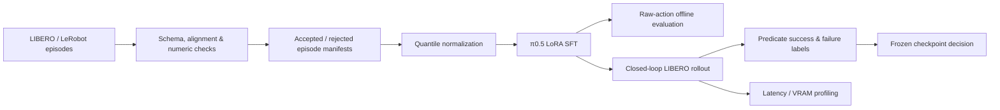
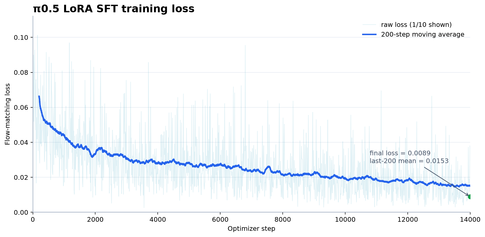
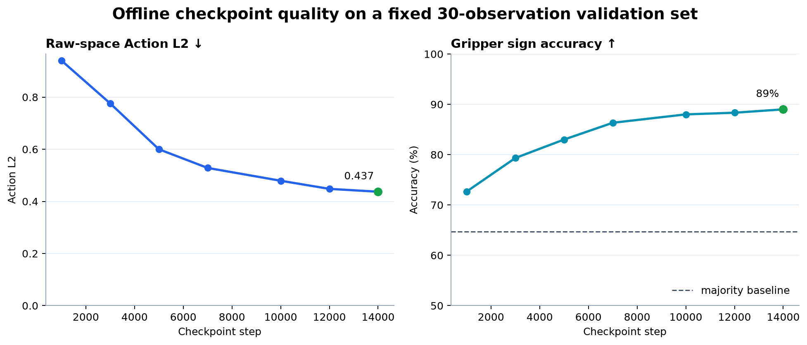

# π0.5 on LIBERO: LoRA Fine-tuning, Evaluation and Deployment

<p align="center">
  
  
  
  
</p>

基于 [OpenPI](https://github.com/Physical-Intelligence/openpi) 的 π0.5 机器人策略训练项目。项目覆盖 **LIBERO/LeRobot 数据审计、quantile normalization、LoRA SFT、离线动作评测、闭环 rollout、失败归因和 bf16 部署测量**；Reward-guided policy improvement 仅作为后续探索性扩展。

> 核心定位：不是只跑通一次训练，而是建立一条从数据到任务级闭环评测、可复现且可回滚的 VLA 工程链路。

## Closed-loop Demos

| Two-object sequential manipulation | Object-target association |
|:---:|:---:|
|  |  |
| Task 1 · two objects into basket · **success** | Task 4 · two mugs onto plates · **success** |
| **Precision placement** | **Observed failure mode** |
|  |  |
| Task 5 · book into caddy · **success** | Task 8 · second-object grasp failure |

<details>
<summary><b>Representative failures</b> — grasp, placement and long-horizon recovery</summary>

| Placement outside target | Premature microwave release |
|:---:|:---:|
|  |  |

</details>

## Key Results

| Evaluation | Result | What it shows |
|---|---:|---|
| Task 5, states 0–9 | **9/10** | final SFT; old 5k was 0/10, official π0.5 was 10/10 |
| Task 1, states 0–9 | **10/10** | two-object sequential manipulation |
| LIBERO-10 breadth screen | **25/30** | 10 tasks × 3 states; diagnostic screen, not an official benchmark |
| Dataset inventory | **1,693 episodes / 40 tasks** | LeRobot parquet metadata and task mapping |
| Sample quality audit | **6 episodes / 1,908 frames, 0 flagged** | dual-view images, 8-D state, 7-D actions, finite/range checks |
| Raw-space Action L2 | **0.437** | fixed 30-observation offline set at step 13,999 |
| Gripper sign accuracy | **89%** | same fixed offline set |
| Steady policy-query latency | **83.25 ms mean / 99.90 ms P95** | bf16, batch 1, RTX 5090 |

## What This Project Demonstrates

| VLA internship capability | Evidence in this repository |
|---|---|
| Data pipeline | LeRobot parquet parsing; image/state/action/prompt alignment; NaN/Inf and episode checks |
| Model adaptation | π0.5 LoRA SFT on a 24 GB-class training setup; 14k-step second-round training |
| Fair offline evaluation | fixed samples/noise; predictions converted back to raw LIBERO action space |
| Closed-loop evaluation | official environment predicates, fixed protocol, per-state JSONL and videos |
| Robustness analysis | initial-state controlled comparison, Wilson confidence intervals, failure taxonomy |
| Deployment engineering | JAX cold-start separation, steady latency, resident/peak VRAM measurements |
| Research discipline | frozen checkpoint SHA, explicit limitations, negative RL result retained rather than cherry-picked |

## System and Data Pipeline



Training sample:

```text
agent-view RGB + wrist RGB + 8-D robot state + language instruction
                              ↓
                  π0.5 flow-matching policy
                              ↓
                    10 × 7 action chunk
```

Dataset: `physical-intelligence/libero`, 273,465 training examples. The executed LIBERO action is 7-D; rollout replans every 5 environment steps.

### Data quality and manifest cleaning

The project uses public demonstrations rather than claiming teleoperation or synthetic data generation. Cleaning is non-destructive: source parquet files stay read-only, and each episode is routed to an accepted or rejected manifest with explicit reasons.

| Stage | Checks | Evidence / output |
|---|---|---|
| Inventory | metadata files, 1,693 episode files, 40 task texts | `logs/day12_data_format_check/` |
| Multimodal alignment | agent/wrist RGB, task mapping, frame/episode IDs | `logs/day8_samples/`, `logs/day9_images/` |
| Numeric quality | 8-D state, 7-D action, NaN/Inf, range and zero-action checks | `logs/day10_action_state_stats/`, `logs/day11_clean_check/` |
| Manifest filtering | deterministic accepted/rejected JSONL; source files are never rewritten | `scripts/data_checks/audit_libero_dataset.py` |
| Stress test | seeded 10% finite action corruption and clean-vs-dirty ablation | `experiments/day18_dirty_ablation/` |

The checked sample contained six episodes and 1,908 frames with no missing images, NaN/Inf values or configured range violations. This is reported as a sampled audit, not a full-dataset guarantee. See the [data pipeline note](docs/data_pipeline.md).

## Training

Formal second-round SFT used LoRA, bf16 and quantile normalization. The complete log contains all steps `0…13,999`; the final recorded flow-matching loss is `0.0089`, while the last-200-step mean is `0.0153`.



Offline checkpoint evaluation uses the same 30 observations, action horizon and noise protocol for every checkpoint. Both raw-space Action L2 and gripper sign accuracy improve across training.



Rebuild these figures from source evidence:

```bash
python scripts/presentation/build_readme_assets.py --repo-root .
```

The public [training-loss CSV](docs/media/readme/sft_training_loss.csv) allows the loss figure to be regenerated without publishing the full server log.

## Ablation Studies

| Variant | Last-20 training loss | Raw Action L2 ↓ | Raw RMSE ↓ | Interpretation |
|---|---:|---:|---:|---|
| Clean, quantile norm | 0.0798 | **1.212** | **0.543** | best raw-action metrics |
| Clean, no norm | **0.0498** | 1.337 | 0.564 | lower training loss did not mean better raw-action quality |
| ~10% dirty actions, quantile norm | 0.1072 | 1.308 | 0.570 | corrupted actions degraded both training stability and evaluation |

| Data-scale training curves | Normalization / dirty-data curves |
|:---:|:---:|
|  |  |

- **Data scale:** under the same 100-step budget, lower training loss on a smaller subset does not imply better generalization.
- **Normalization:** No-Norm had a numerically lower training loss, but quantile normalization produced better raw-space Action L2 and much lower error on small-scale rotation dimensions.
- **Dirty data:** corrupting roughly 10% of actions in five episodes increased mean training loss by `21.4%` and raw-space Action L2 by `7.96%`.

Detailed tables and reproducibility notes: [full project report](PROJECT_REPORT.md#12-ablation-experiments).

## Closed-loop Evaluation

The formal protocol fixes the suite, task/state IDs, environment seed, replan horizon and maximum policy steps. Results report raw counts and Wilson 95% confidence intervals rather than accuracy alone.

```text
suite             = libero_10
environment seed  = 7
replan_steps      = 5
max policy steps  = 520
precision         = bfloat16
```

Task 5 uses the exact same states 0–9 for the official policy, old 5k checkpoint and final SFT:

| Policy | Success | Wilson 95% CI |
|---|---:|---:|
| Official π0.5 LIBERO | 10/10 | [0.722, 1.000] |
| Old 5k | 0/10 | [0.000, 0.278] |
| Final SFT, step 13,999 | **9/10** | [0.596, 0.982] |

See the full [evaluation protocol](docs/eval_protocol.md) and [formal result JSON](experiments/day23_eval/formal_compare/task5_formal_results.json).

## Robustness and Failure Analysis

| Controlled comparison | Success | Wilson 95% CI | Interpretation |
|---|---:|---:|---|
| Task 5, state 0 | 9/10 | [0.596, 0.982] | reference initial state |
| Task 5, state 2 | 7/10 | [0.397, 0.892] | lower observed rate; intervals overlap |

Changing only Task 5's predefined initial state produced `9/10` versus `7/10`; because the Wilson intervals overlap, this is reported as initial-state sensitivity rather than a statistically significant difference.

| Observable primary failure label | Count among 5 failures | What happened |
|---|---:|---|
| `place_outside_target` | 2/5 | object reached the target area but final placement missed |
| `contact_no_grasp` | 2/5 | end-effector contacted the object without securing it |
| `timeout_or_oscillation` | 1/5 | repeated motion without task completion |

These are five observed cases, not population-level causal frequencies. See [failure distribution](docs/failure_distribution.md).

## Deployment Measurements

| Metric | Measured value |
|---|---:|
| Precision / batch | bf16 / 1 |
| Returned action chunk | `[10, 7]` |
| Cold first query | 24.85 s |
| Steady mean / P50 / P95 | 83.25 / 81.18 / 99.90 ms |
| Loaded-idle VRAM | 24.040 GiB |
| Observed sampled peak | 24.114 GiB |

Cold-start latency includes JAX tracing/JIT compilation and is intentionally separated from steady-state inference. VRAM was sampled with `nvidia-smi` at approximately 200 ms intervals. Details: [deployment note](docs/deployment_note.md).

## Reward-guided Policy Improvement — Exploratory Extension

This is a secondary extension, not the project's headline result. I implemented official-predicate rewards, auditable action-chunk trajectories, development/held-out/guard isolation and LoRA-only reward-weighted flow matching.

Under the strict final multi-seed Stage 3 development protocol, Frozen SFT achieved `4/20`, while the best RL candidate achieved `2/20`. No candidate was promoted and the final held-out set remained unconsumed. This result is kept to document the task-specialization/forgetting trade-off, not to claim RL superiority.

See [RL extension summary](docs/rl_extension_summary.md).

## Quick Start

This repository stores experiment code and lightweight evidence. Model checkpoints and datasets are intentionally excluded.

```bash
git clone https://github.com/zilin566/pi05-libero-finetune.git
cd pi05-libero-finetune

# Dataset/schema checks
python scripts/data_checks/audit_libero_dataset.py \
  --dataset-root /path/to/physical-intelligence/libero \
  --output-dir experiments/data_quality/latest

# Rebuild public figures (matplotlib required)
python scripts/presentation/build_readme_assets.py --repo-root .
```

Model training and rollout require an [OpenPI](https://github.com/Physical-Intelligence/openpi) environment, LIBERO assets and a compatible GPU. Parameterized training/evaluation commands are preserved in [PROJECT_REPORT.md](PROJECT_REPORT.md).

## Repository Layout

```text
pi05-libero-finetune/
├── README.md                 # concise project landing page
├── PROJECT_REPORT.md         # full experiment record
├── configs/                  # training and normalization snapshots
├── scripts/
│   ├── data_checks/          # dataset validation
│   ├── evaluation/           # offline and rollout evaluation
│   ├── presentation/         # deterministic README figures
│   └── training/             # custom training entries
├── experiments/              # lightweight summaries and figures
├── docs/                     # protocols, failure analysis, deployment
└── docs/media/               # selected public demos and plots
```

## Scope and Limitations

- Simulation only; no real-robot validation and no sim-to-real claim.
- RGB agent/wrist cameras are used; this project does not claim RGB-D sensing.
- The 25/30 result is a three-state-per-task breadth screen, not an official LIBERO benchmark score.
- No INT8 quantization, unseen-object benchmark, lighting randomization or sensor-noise experiment was performed.
- Demonstrations come from the public LeRobot dataset; no teleoperation collection or synthetic trajectory generation is claimed.
- Policy RNG is not fully controllable in the original SFT evaluation, so exact per-action reproduction is limited.
- The final RL study did not outperform Frozen SFT; no RL checkpoint replaced the baseline.

## Documentation

- [Full project report](PROJECT_REPORT.md)
- [Evaluation protocol](docs/eval_protocol.md)
- [Failure distribution](docs/failure_distribution.md)
- [Deployment note](docs/deployment_note.md)
- [Data format](docs/data_format.md)
- [Data quality and manifest pipeline](docs/data_pipeline.md)
- [Normalization note](docs/norm_stats_note.md)
- [RL extension summary](docs/rl_extension_summary.md)

## Acknowledgements

Built on [OpenPI](https://github.com/Physical-Intelligence/openpi), [LIBERO](https://github.com/Lifelong-Robot-Learning/LIBERO) and the `physical-intelligence/libero` LeRobot dataset. Checkpoints, caches and full rollout archives are not distributed in this repository.
